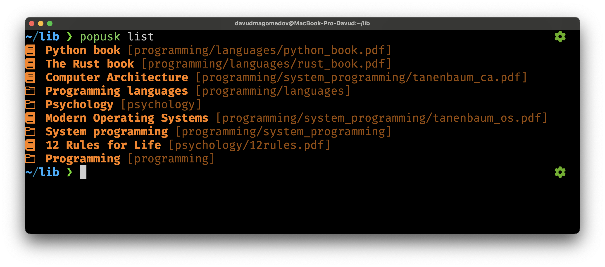
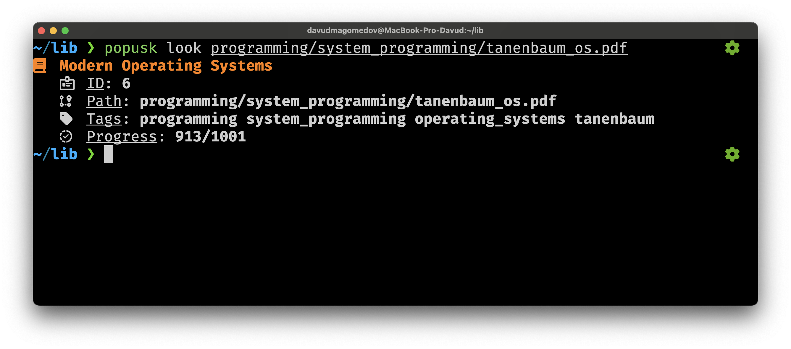

# popusk
**popusk** is a terminal book manager aimed at simplifying work with documents and books.




## Getting started
1. [Tutorial](docs/tutorial.md)
2. [Configuration](docs/config.md)
3. [Scripts](docs/lua_script.md)

## Build
1. [Install rust](https://www.rust-lang.org/tools/install).
2. Clone the repository and enter into it.
```bash
git clone https://github.com/davudMagomedov/popusk.git && cd popusk
```
3. Clone the configuration repository (or make it yourself).
    - **If your terminal supports Nerd Font**.
    ```bash
    git clone https://github.com/davudMagomedov/popusk-config-nerdfont.git ~/.config/popusk
    ```
    - **If your terminal doesn't support Nerd Font**.
    ```bash
    git clone https://github.com/davudMagomedov/popusk-config.git ~/.config/popusk
    ```
4. Build the project.
```bash
cargo build --release
```
5. Binary in `target/release/` directory.

### Build features
There's no build feature yet.
